# Dot Analyzer for SEM micrographs
an ImageJ/Fiji python script for dot spacing and order analysis of SEM micrographs 

--------------------------------------------------------------
This document describes the workings of the ImageJ/Fiji python script **Dot_Analyzer.py**, written by Philippe Girard ([email](philippe.girard@ijm.fr)).

This Python script was written to analyse SEM micrograph as shown here:

	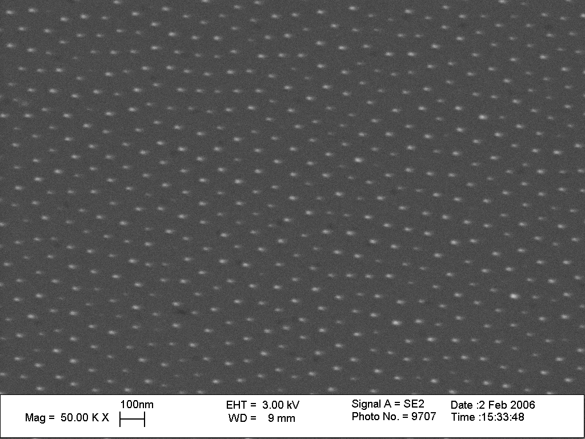
 
<i>Fig. 1:</i> A typical SEM micrograph.

## 1. Installation instructions
* Download the [python script file](https://github.com/phigirard/Dot_Analyzer/blob/main/Dot_Analyzer.py) into your computer.
* For the script to appear in the menu, you should saved in the `ImageJ2.app/scripts` or the `ImageJ2.app/plugins/Scripts` directory (or a subdirectory thereof).
* Otherwise use File > Open…  to open the script `Dot_Analyzer.py` in the [script Editor](https://imagej.net/scripting/script-editor) of ImageJ/Fiji
and Click Run on the bottom of the script editor window (you can also go to : Run > Run in the Script Fiji menu).

	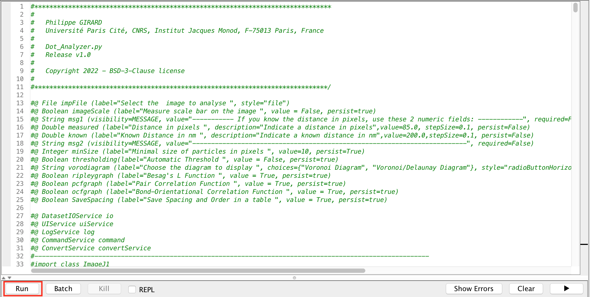
 
<i>Fig. 2:</i> Script `Dot_Analyzer.py` in the script Editor of ImageJ/Fiji.

## 2. The “Parameters” main window.
When you start the plugin, you have to define different parameters for the analysis and to select the different diagrams/plots that you want to visualize (Fig. 3). 

	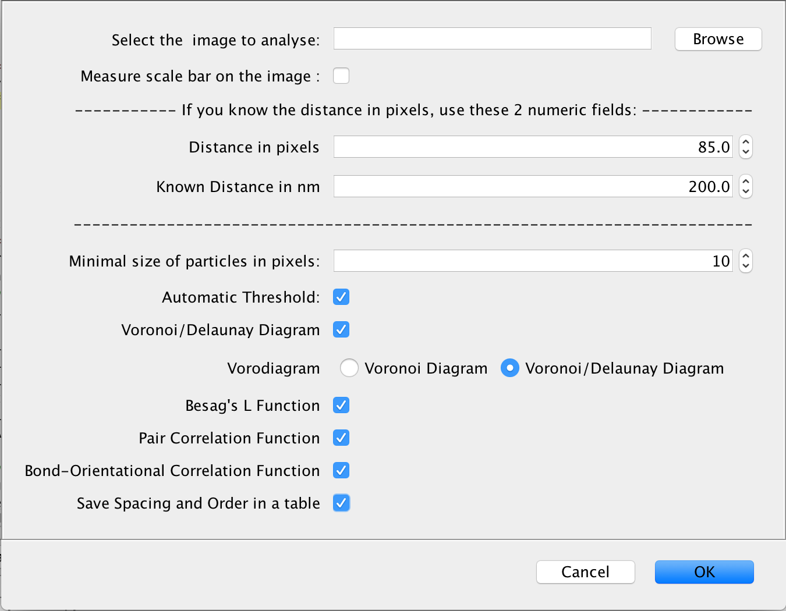
 

						      
You must indicate: 

1. `Select the image to analyse`: Choose the micrograph image. 
2. `Measure scale bar on the image`: If you do not know the size in nm of a pixel or if your image is not automatically calibrated spatially, you should select this option. In this case before the analysis a dialog box is asking the user to draw a rectangle to fit with the scale bar (it is recommanded to zoom in the region of the scale bar usually at the bottom left of the micrograph) as shown in Fig 4.  

	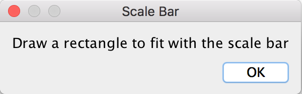
   	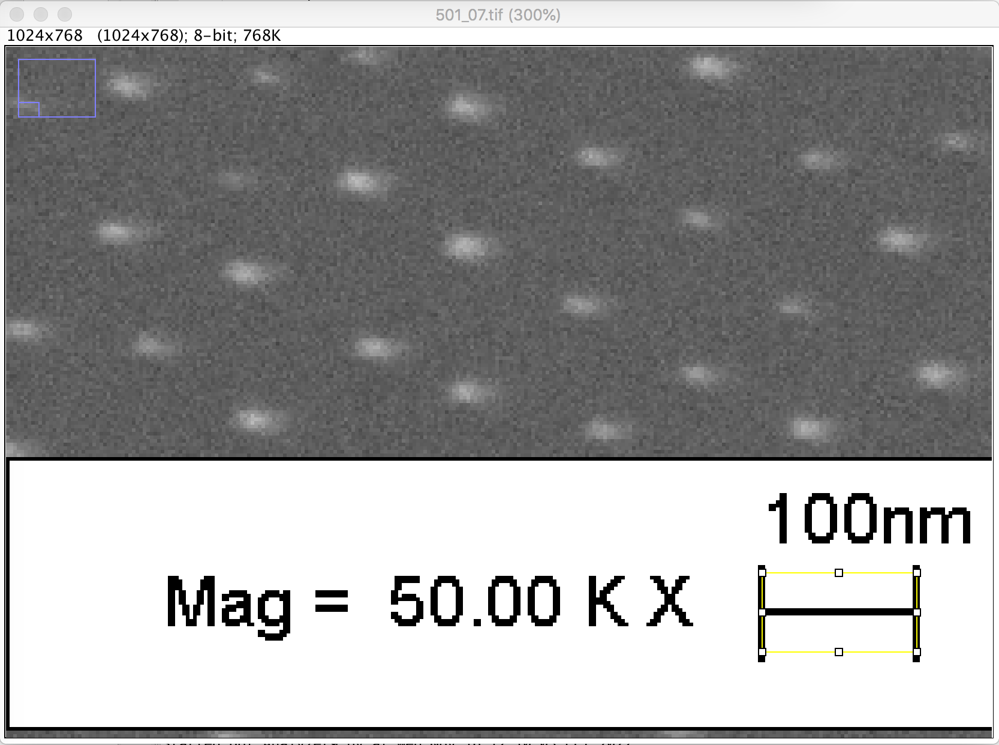    
 
<i>Fig. 4:</i> Scale bar measurement

 

After this dialog, a second dialog box (Fig 5) is asking for the known distance in nm written at the scale bar of the micrograph

	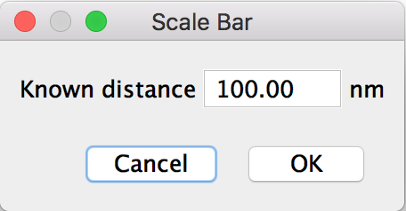      
 
<i>Fig. 5:</i> "Known Distance" Dialog box

 

3. If the distance in pixels and the corresponding distance in nm are known, the previous step can be bypassed (by ticking off the previous checkbox) and these 2 numeric fields: `Distance in pixels` and `Known Distance in nm` can be used for pixel conversion. 
For example, in a field-emission scanning electron microscope (FE-SEM, LEO-1530, LEO, Oberkochen, Germany), the parameters are 200 nm = 171 pixels at 100.00 KX magnification. 

4. `Minimal size of particles in pixels`: Set the minimum size (in pixels^2) to exclude objects that appear in the binary image that are clearly not of interest. This parameter is the same that appears in “Size ( ^2)” of the “Analyze Particles” window. 

5. `Automatic Threshold`: if the checkbox is ticked on, the image is automarically thresholded with the "Triangle" method. Otherwise, the Threshold window (Image ▷ Adjust ▷ Threshold…) is displayed for allowing the user to manually select the thresholding method or to interactively explore the threshold value that segments every dots (in red). 

6. `Choose the diagram to display`: 2 diagrams can be displayed : the Voronoi diagram (or tesselation) [**[1-4]**](#references) or, on top of the voronoi tessalation, the Delaunay diagram (or triangulation) [**[3-4]**](#references).

* The Voronoi diagram is a simple mathematical construct that has proved useful in fields as diverse as environmental studies, cell biology, crystallography, transportation planning, and communications theory. Given a set of points (the center of mass of each gold-dot), the Voronoi diagram defines a series of cells surrounding each point. Each cell contains all points that are closer to its defining point than to any other point in the set. Subsequently, the “borders” of the cells are equidistant between the defining points of adjacent cells.By doing so, the number of borders give you the number of closest neighbors. 
For more information about the Voronoi diagram, see the [Wikipedia webpage](http://en.wikipedia.org/wiki/Voronoi_diagram). 

* Delaunay diagram (or triangulation) . In graph theory, the Delaunay triangulation corresponds to the dual graph of the Voronoi tessellation. By dual, I mean to draw a line segment between two Voronoi vertices if their Voronoi polygons have a common edge, or in more mathematical terminology: there is a natural bijection between the two which reverses the face inclusions. This diagram gives the distance between the closest neighbors of each gold-dot. For more information about the Voronoi diagram, see the [Wikipedia webpage](http://en.wikipedia.org/wiki/Delaunay_triangulation). 

7. `Besag’s L Function`: The Besag's <i>L</i> Function is based on the Ripley's <i>K</i> Function. Details of various theoretical aspects of K are in books [**[5-7]**](#references). Ripley’s K function is a popular tool to analyze mapped spatial point pattern. It is defined without edge correction as:

	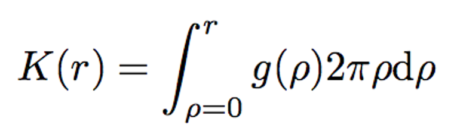

If points are distributed independently from each other, g(ρ)=1 for all values of ρ, so <i>K(r) = πr2</i>. This value is used as a benchmark: 

* <i>K(r) > πr2</i> indicates that the average value of g(ρ) is greater than 1. The probability to find a neighbor at the distance ρ is then greater than the probability to find a point in the same area anywhere in the domain: points are aggregated.  

* Inversely, <i>K(r) < πr2</i> indicates that the average neighbor density is smaller than the average point density on the studied domain. Points are dispersed. <i>K(r)</i> is estimated by the ratio of the average number of neighbors on the density, estimated itself by the total number of points divided by the domain area λ which is the density (number per unit area = N/area of the picture) of event. Given that only the points in a bounded window of observation can be studied, edge correction is necessary to obtain precise estimates. The weighted edge-corrected function <i>K(r)</i> is defined as: 

	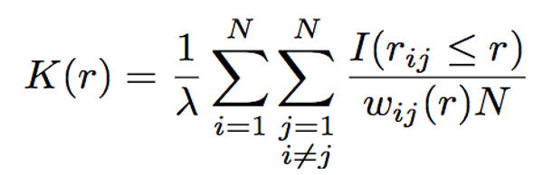

where <i>I(rij ≤ r)</i> is an indication function with values either 0 if the condition does not hold or 1 if the condition holds and where the weight <i>wij(r)</i> is the proportion of the circumference of a circle centered at the gold-dot <i>i</i> passing through the gold-dot <i>j</i> and that is inside the region of interest (ROI), which is defined as  

	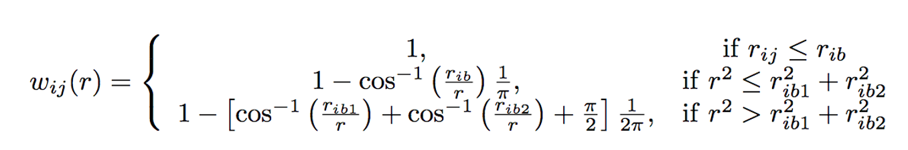

where <i>rib</i> is the distance from the gold-dot <i>i</i> to the nearest boundary, <i>rib1</i> and <i>rib2</i> are the distances from gold-dot <i>i</i> to the nearest two boundaries. The first case when the circle is within the ROI, the second case is when the circle intersects with only one border and the last case is when the circle intersects two borders in a corner. Note that <i>wij(r)</i> could be unbounded as <i>r</i> increases in practice. Following the recommendation by Ripley, <i>wij(r)</i> could be restricted to be less than or equal to 4 for the gold-dot <i>i</i> having distance to <i>j</i> greater than the distance from the gold-dot <i>i</i> to the nearest boundary. 
The Besag's <i>L</i> function is just a normalization of the Ripley's function:  

	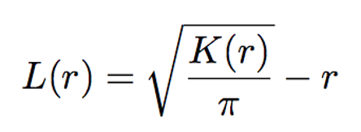

because for a homogenous Poisson process, the Ripley function is <i>K(r) = πr2</i>. So the Besag's function is a measure of the deviation from a Poisson distribution and it is very useful because <i>L(r)</i> has the advantage of linearizing <i>K(r)</i> and stabilizing its variance and has an expected value of zero for Poisson distribution. So <i>L(r)</i> can also be considered as a measure of the clusterization. 
 

8. `Pair correlation function` is measured with the Epanechnikov kernel [**[8]**](#references) and an Ohser-Stoyan edge corrector factor [**[9]**](#references). The estimation of the pair correlation function <i>g(r)</i> can be obtained by determining all pairs of gold-dots having inter-gold-dot distance in some small interval and counting their numbers. Since <i>g(r)</i> is a density function, a more elegant method can be employed. Following the recommendation of Penttinen et al. [**[6]**](#references), a kernel estimator is used for <i>g(r)</i>. The chosen kernel function is the Epanechnikov kernel: 

	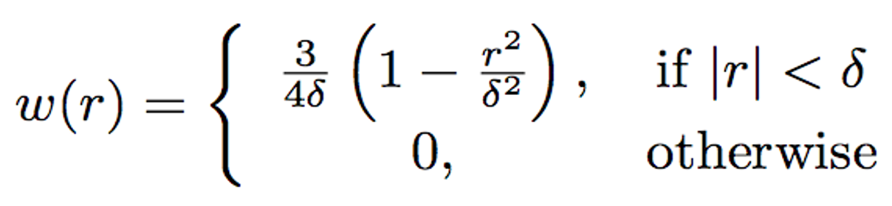

The kernel δ is very important because it determines the degree of smoothness of the function. Based on Penttinen et al. [**[8]**](#references), 

	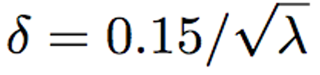

in this study. Then, the pair correlation function can be estimated as:  

	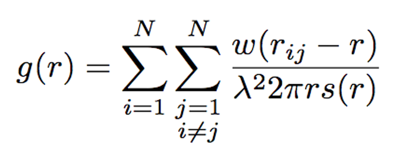

where <i>w(.)</i> is the Epanechnikov kernel function defined above, <i>λ=N/A</i> is the estimated density (gold-dots per unit area), <i>rij</i> is the distance between the gold-dots <i>i</i> and <i>j</i> and <i>s(r)</i> is the edge correction factor. For rectangular or square plots, the Ohser–Stoyan edge correction factor [**[9]**](#references) can be adopted: 

	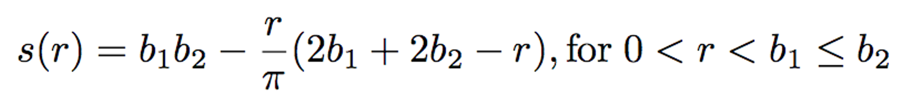

where <i>b1</i> and <i>b2</i> are the side lengths of the image (that means the height and the width) and <i>s(r) &lt; width x height</i>. 

9. `Bond-orientational correlation function`: The (global) bond-orientationel order parameter 6 was introduced by D. R. Nelson and B. I. Halperin to characterize the structural order in 2D systems [**[10-11]**](#references). It is given: 

	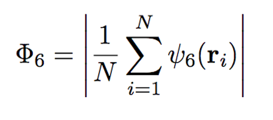

with <i>ψ6</i> is the local value for the particle <i>i</i> located at <i>r=(x,y)</i>: 

	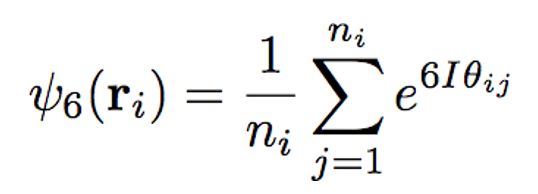

where I is the imaginary unit (I2=-1), <i>θij</i> is the angle between the particles <i>i</i> and <i>j</i> and an arbitrary but fixed reference axis and <i>ni</i> the number of nearest neighbors of the dot <i>i</i>. The bond-orientational correlation length <i>ξ0</i> was extracted from the “zero-momentum” correlation function of <i>ψ6</i> which is called bond-orientational correlation function <i>g6(r)</i> and defined by: 

	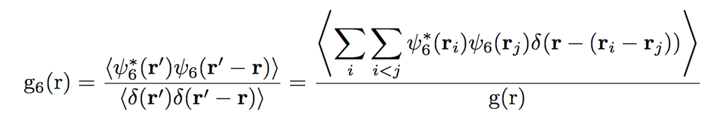

where the denominator is related to the pair correlation function <i>g(r)</i> and: 

	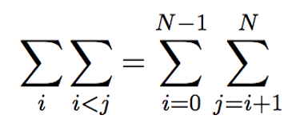

For a 2D system (or the quasi long-ranged bond orientational order of the hexatic state), the envelope of this correlation function decay to zero exponentially [**[12-14]**](#references): 

	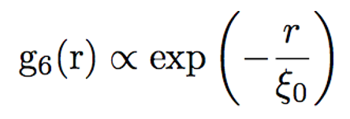

Hence, <i>ξ0</i> is a measure for the typical size of the single crystalline domain, i.e., larger is <i>ξ0</i> and larger is the crystalline domain (and better is the order). The bond-orientational correlation length <i>ξ0</i> is determined by fitting <i>log(g6(r))</i> with a line Ar+B by using the fitting algorithm described in Numerical Recipes Section 15.2. The plugin shows the function <i>g6(r)</i> with the exponential fit in red and the length <i>ξ0</i> (with the χ2 test) in the same plot.  

10. `Save Spacing and Order in a table` this checkbox indicates that you want to save the spacing and the order in a text file. If you select this option, a “Save Spacing & Order” window will appear at the end of the analysis. 
