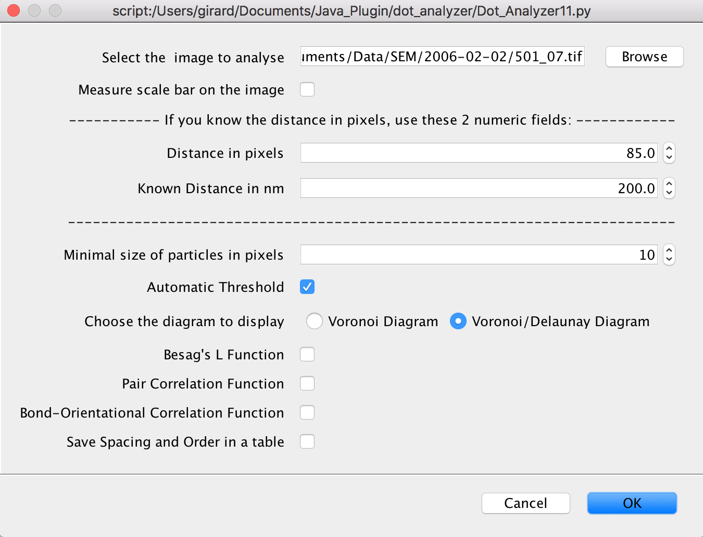

# Dot Analyzer for SEM micrographs
an ImageJ/Fiji python script for dot spacing and order analysis of SEM micrographs 

--------------------------------------------------------------
This document describes the workings of the ImageJ/Fiji python script **Dot_Analyzer.py**, written by Philippe Girard ([email](philippe.girard@ijm.fr)).

This Python script was written to analyse SEM micrograph as shown here:

	
 
<i>Fig. 1:</i> A typical SEM micrograph.

## 1. Installation instructions
* Download the [python script file](https://github.com/phigirard/Dot_Analyzer/blob/main/Dot_Analyzer.py) into your computer.
* For the script to appear in the menu, you should saved in the `ImageJ2.app/scripts` or the `ImageJ2.app/plugins/Scripts` directory (or a subdirectory thereof).
* Otherwise use File > Open…  to open the script `Dot_Analyzer.py` in the [script Editor](https://imagej.net/scripting/script-editor) of ImageJ/Fiji
and Click Run on the bottom of the script editor window (you can also go to : Run > Run in the Script Fiji menu).

	
 
<i>Fig. 2:</i> Script `Dot_Analyzer.py` in the script Editor of ImageJ/Fiji.

## 2. The “Parameters” main window.
When you start the plugin, you have to define different parameters for the analysis and to select the different diagrams/plots that you want to visualize (Fig. 3). 

	
 

						      
You must indicate: 

1. `Select the image to analyse`: Choose the micrograph image. 
2. `Measure scale bar on the image`: If you do not know the size in nm of a pixel or if your image is not automatically calibrated spatially, you should select this option. In this case before the analysis a dialog box is asking the user to draw a rectangle to fit with the scale bar (it is recommanded to zoom in the region of the scale bar usually at the bottom left of the micrograph) as shown in Fig 4.  

	
   	    
 
<i>Fig. 4:</i> Scale bar measurement

 

After this dialog, a second dialog box (Fig 5) is asking for the known distance in nm written at the scale bar of the micrograph

	      
 
<i>Fig. 5:</i> "Known Distance" Dialog box

 

3. If the distance in pixels and the corresponding distance in nm are known, the previous step can be bypassed (by ticking off the previous checkbox) and these 2 numeric fields: `Distance in pixels` and `Known Distance in nm` can be used for pixel conversion. 
For example, in a field-emission scanning electron microscope (FE-SEM, LEO-1530, LEO, Oberkochen, Germany), the parameters are 200 nm = 171 pixels at 100.00 KX magnification. 

4. Minimal size of particles in pixels: Set the minimum size (in pixels^2) to exclude objects that appear in the binary image that are clearly not of interest. This parameter is the same that appears in “Size ( ^2)” of the “Analyze Particles” window. 

5. Automatic Threshold: if the checkbox is ticked on, the image is automarically thresholded with the "Triangle" method. Otherwise, the Threshold window (Image ▷ Adjust ▷ Threshold…) is displayed for allowing the user to manually select the thresholding method or to interactively explore the threshold value that segments every dots (in red). 
